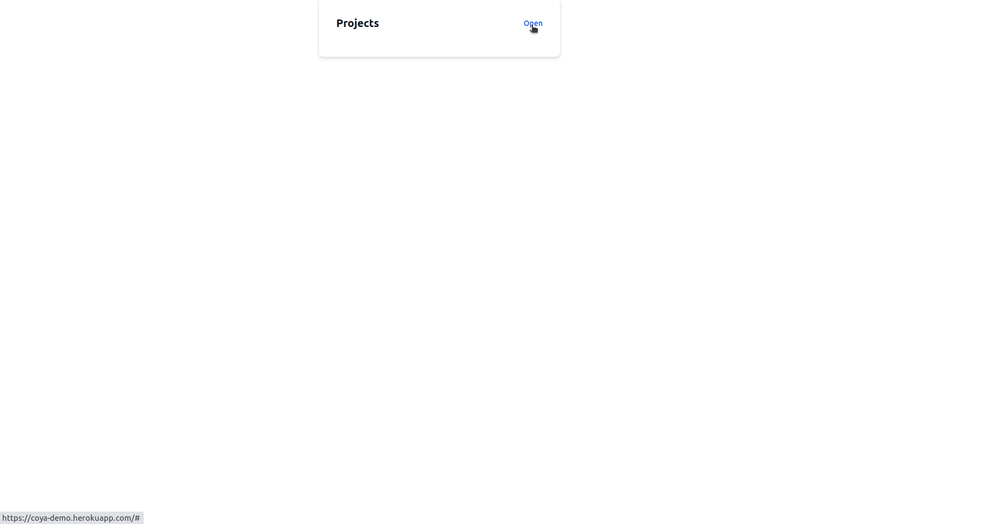
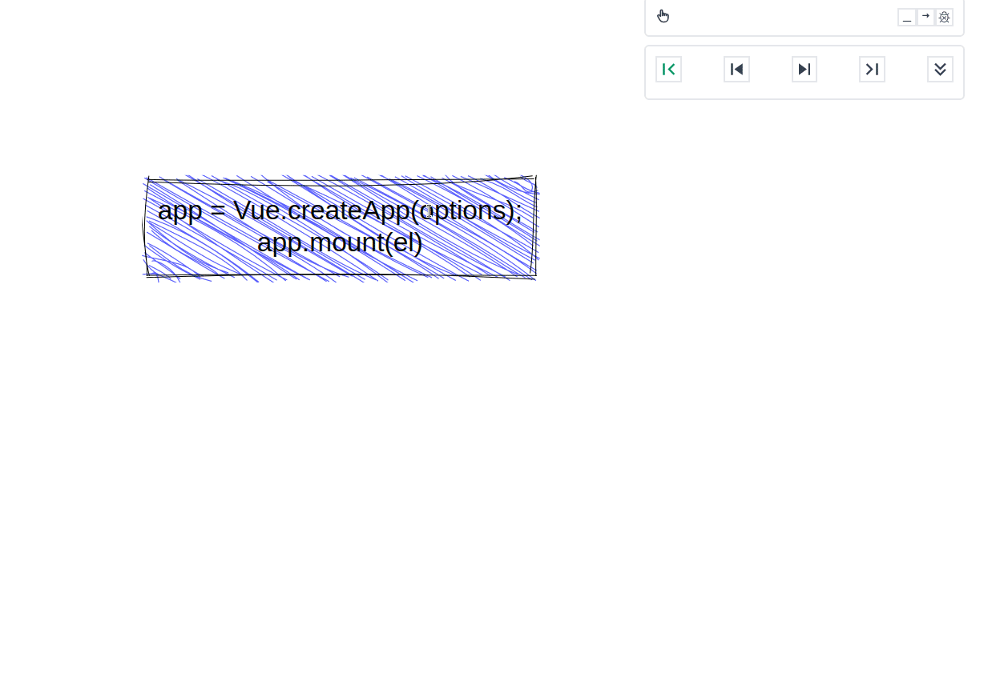
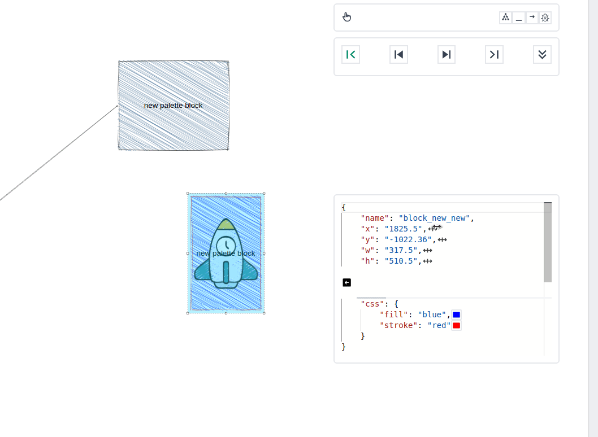
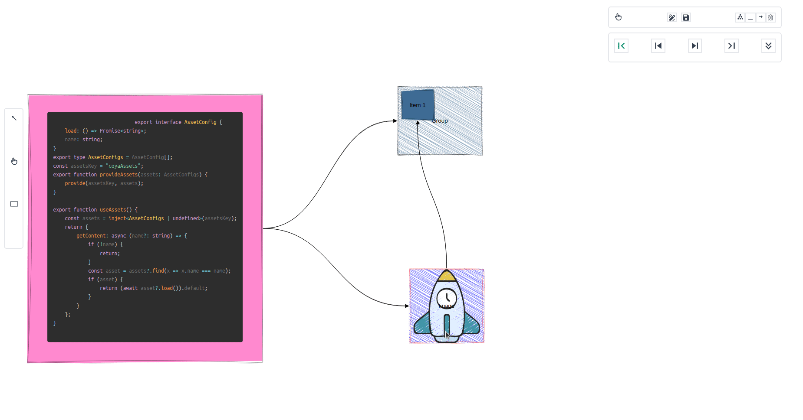
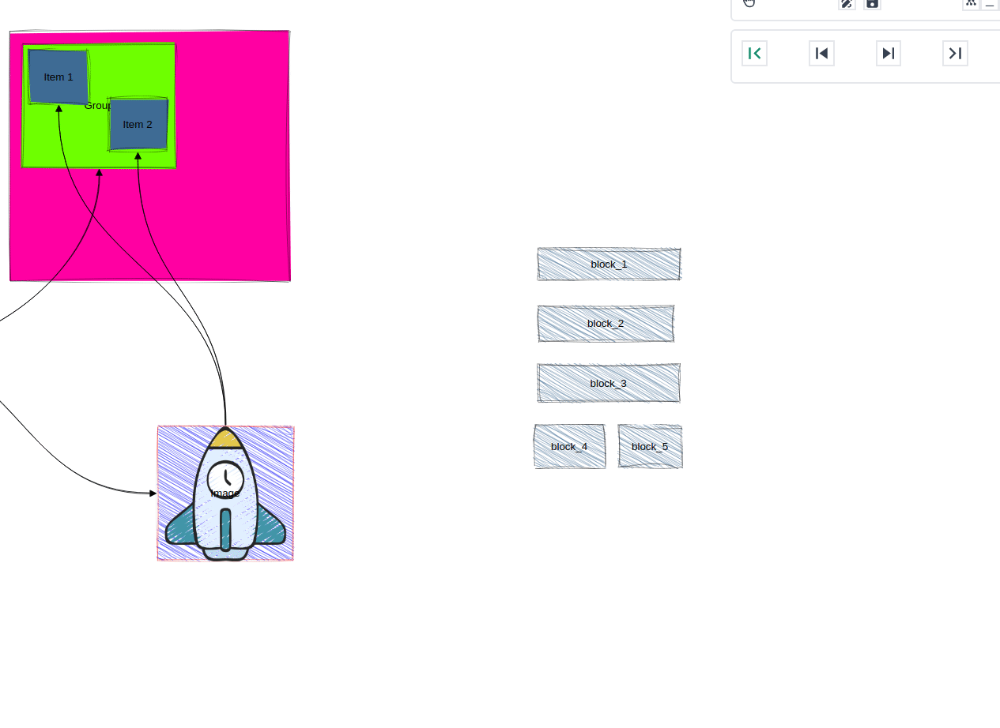

# Coya


<p align="center">
<table>
<tbody>
    <td align="center">
    <br>
    Status: <b>Beta 🎉</b><br>
    Give it a star. It really motivates us 🤩
    
    </td>
</tbody>
</table>
</p>

Coya is a diagram drawing library.
The resulting diagram is just a JSON file, so you can:
- 🤓 commit it to git and compare it with the prev version
- 💡 generate a diagram from any programming language
- ✨ animate diagram, like in PowerPoint
- 🔨 use a powerful editor
- 🧰 use vscode extension (in development)


# Demo
You can try it [here](https://coya-demo.herokuapp.com/)

Here is an example of how to use it:


# Available blocks
- rectangles and arrows
- images
- code files
- iframes


# Run locally
First time:
```bash
pnpm i
```
Run project:
```bash
pnpm vue
```
# Sponsors

<table>
  <tbody>
    <tr>
      <td align="center" valign="middle">
        <a href="https://upswot.com/" target="_blank"></a>
      </td>
    </tr>
  </tbody>
</table>

# Contributors

Follow our [Contribute guide](CONTRIBUTING.md).

# Keep posted

More details on [Twitter](https://twitter.com/AMykulych)

# More examples (only gifs for now)






